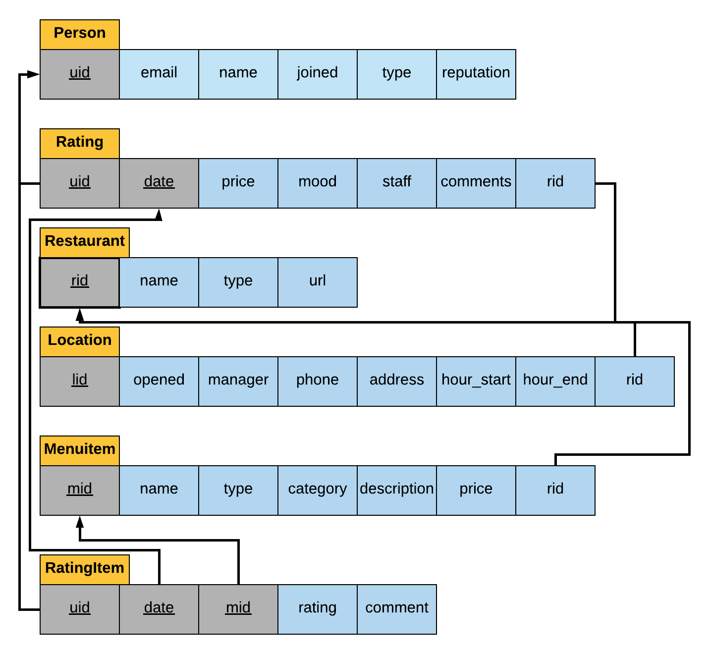

# CSI 2132: Databases I

This repository contains the final project for the Databases I course. This project makes use of Docker in order to complete the initial setup and to get you setup as quickly as possible.


## Diagram



## Setup

Note that these were the instructions for the server setup at the start of the project. A lot has changed and these are now mostly outdated. The folder structure is different, some of the dependencies have changed.

1. Download Docker.
2. Download VirtualBox.
3. Pull this repository to your system.
4. Create a file named `php.ini` inside of the `sites` directory. `<YOUR USERNAME>` and `<YOUR PASSWORD>` must be the same as in the `docker-compose.yml` file. The `php.ini` file will contain the following

```
[php]
register_globals = true
track_errors = true
include_path = "/var/www/sites/public"

[database]
driver = pgsql
host = postgresql
port = 5432
schema = test
db_name = postgres
username = <YOUR USERNAME>
password = <YOUR PASSWORD>
```

## Running the Webserver

- Type `docker-compose up` to start the server.
- Type `docker-compose down` to stop the server.

